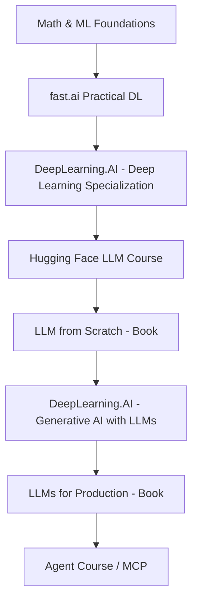

## Hugging Face ==Site==

https://huggingface.co/learn

### LLM Course
#### Transformer models
#### Using transformers
#### Fine tuning a pretrained model
#### Sharing models and tokenizers
#### The tokenizers library
#### Classical NLP tasks
#### How to ask for help
#### Building and sharing demos
#### Curate high-quality datasets
#### Fine-tune large language models
#### Build reasoning models

### Robotics Course
#### Introduction
#### Classical robotics

### MCP Course
#### Introduction to model context protocol
#### Use case: end-to-end MCP application
#### Advanced MCP development: Custom workflow servers
#### Use case: Build a pull request agent on the hub

### A smol course
#### Instruction tunning
#### Preference alignment
#### Vision language models
#### Model evaluation

### Agent Course
#### Introduction to agents
#### Frameworks for AI Agents
#### The smolagents frameworks
#### The Llamaindex framework
#### The langgraph framework
#### Use case for agentic RAG
#### Final project - Create, test, and certify your agent
#### Fine-tuning an LLM for function-calling
#### Agent observability and evaluation
#### Agents games with pokemon

### Deep RL Course

#### Introduction to deep reinforcement learning
#### Introduction to deep reinforcement learning with Huggy
#### Introduction to Q-Learning

#### Deep Q-Learning with Atari Games

#### Automatic Hyperparameter Tuning with Optuna

#### Policy Gradient with PyTorch

#### Introduction to Unity ML-Agents

#### Actor Critic methods with Robotics environments

#### Introduction to Multi-Agents and AI vs AI

#### Proximal Policy Optimization (PPO)

#### Proximal Policy Optimization (PPO) with Doom

#### Advanced Topics in Reinforcement Learning

#### Imitation Learning with Godot RL Agents

### Computer Vision Course
#### Fundamentals
#### Convolutional Neural Networks
#### Vision Transformers
#### Multimodal Models
#### Generative Models
#### Basic CV Tasks
#### Video and Video Processing
#### 3D Vision, Scene Rendering and Reconstruction
#### Model Optimization
#### Synthetic Data Creation
#### Zero Shot Computer Vision
#### Ethics and Biases
#### Outlook

### Audio Course

#### Working with audio data
#### A gentle introduction to audio applications
#### Transformer architectures for audio
#### Build a music genre classifier
#### Automatic Speech Recognition
#### From text to speech
#### Putting it all together
#### Finish line

### ML for Games Course
#### Create a smart Robot NPC using Hugging Face 🤗 and Unity Sentis
#### Finding the idea and writing the GDD
#### Classical AI in Video Games
#### AI Tools for Game Developers 🎨
#### Crafting LLM-powered NPC with Gigax and Cubzh

### Diffusion Course
#### Introduction to diffusion models
#### Fine-Tuning, Guidance and Conditioning
#### Stable Diffusion
#### Going Further with Diffusion Models

### ML for 3D course
#### What is 3D?
#### Multi-view diffusion
#### Gaussian Splatting
#### Meshes
#### Capstone

## Building LLMs for production ==Book==

### Introduction to LLMs

### LLM Architectures and Landscape

### Introduction to Prompting

### Retrieval-Augmented Generation

### Introduction to LangChain && LlamaIndex
### Prompting With LangChain

### Indexes, Retrievers, and Data Preparation

### Advanced RAG

### Agents

### Deployment and Optimization

## Building a Large Language Model (From Scratch) ==Book==

### Understanding large language models
### Working with text data
### Coding attention mechanism
### Implementing a GPT model from scratch to generate text
### Pretraining on unlabeled data

### Fine-tuning for classification
### Fine tuning to follow instructions

## Pratical Deep Learning for Coders  ==Site==

https://course.fast.ai/Lessons/lesson1.html#resources

## Deep Learning AI ==Site==

https://www.deeplearning.ai/

### Deep Learning Specialization - pour bien comprendre les réseaux neuronaux classiques 

https://www.deeplearning.ai/courses/deep-learning-specialization/
### Generative AI with LLMs (pour relier théorie et pratique moderne)

https://www.deeplearning.ai/courses/generative-ai-with-llms/

