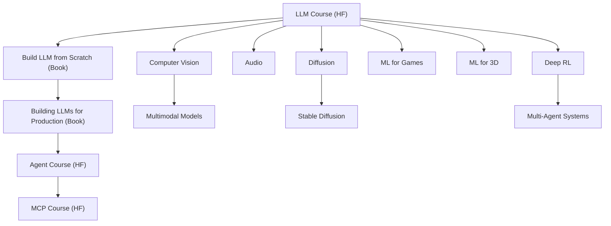

> **Objectif :** Acquérir une compréhension approfondie du fonctionnement des IA modernes (LLMs, agents, RAG, diffusion, etc.) à travers trois axes : pratique (Hugging Face), théorique (LLM from Scratch), et opérationnel (LLMs for Production).  
> **Outil de prise de notes :** Obsidian

---

## 🧩 Structure globale

1. **Hugging Face Learn** → apprentissage pratique et modulaire
    
2. **Building a Large Language Model (From Scratch)** → compréhension théorique interne des modèles
    
3. **Building LLMs for Production** → industrialisation, déploiement, monitoring et agents
    

---

## 🪄 Ordre d'apprentissage recommandé

|Ordre|Domaine|Thèmes clés|Objectif principal|
|---|---|---|---|
|1|**Bases des LLM (Hugging Face)**|Transformers, Tokenizers, Fine-Tuning|Comprendre et utiliser les modèles|
|2|**LLM from Scratch (Book)**|Attention, GPT architecture, entraînement|Comprendre le fonctionnement interne|
|3|**LLMs for Production (Book)**|RAG, LangChain, LlamaIndex, Agents|Construire et déployer des applications IA|
|4|**Agents Course (HF)**|LangGraph, SmolAgents, Observabilité|Développer des systèmes interactifs|
|5|**Spécialisations**|Vision, Audio, Diffusion, 3D, RL|Explorer d’autres branches|
|6|**MCP Course**|Model Context Protocol, intégration|Découvrir la nouvelle génération d’agents|

---

## 📘 Hugging Face Courses

### 🧩 LLM Course

1. Transformer models
    
2. Tokenizers library
    
3. Using transformers
    
4. Fine tuning a pretrained model
    
5. Curate high-quality datasets
    
6. Sharing models and tokenizers
    
7. Build reasoning models
    

### 🤖 Agent Course

1. Introduction to agents
    
2. Frameworks for AI Agents
    
3. SmolAgents / LangGraph / LlamaIndex
    
4. Agentic RAG use case
    
5. Agent observability and evaluation
    
6. Final project: Create, test, and certify an agent
    

### 🧠 MCP Course

1. Introduction to Model Context Protocol
    
2. Advanced MCP development
    
3. Build a pull request agent
    

### 🎮 Deep RL Course

Introduction → Q-Learning → DQN → PPO → Multi-Agent Systems

### 👁️ Computer Vision Course

Fundamentals → CNN → Vision Transformers → Multimodal → Ethics

### 🔊 Audio Course

Audio preprocessing → ASR → TTS → Music Classification

### 🌫️ Diffusion Course

Introduction → Fine-tuning → Stable Diffusion → Guidance

### 🕹️ ML for Games / 3D

AI NPCs, Unity Sentis, Gaussian Splatting, Meshes

---

## 📙 Building a Large Language Model (From Scratch)

1. Understanding large language models
    
2. Working with text data
    
3. Coding the attention mechanism
    
4. Implementing GPT from scratch
    
5. Pretraining on unlabeled data
    
6. Fine-tuning for classification and instruction following
    

---

## 📗 Building LLMs for Production

1. Introduction to LLMs
    
2. Architectures and Landscape
    
3. Prompting and RAG Foundations
    
4. LangChain / LlamaIndex / Vector DBs
    
5. Agents and Orchestration
    
6. Deployment and Optimization
    
7. Monitoring and Evaluation
    

---

## 🧮 Fondations mathématiques et ML (à intégrer avant tout)

- **Mathématiques pour le ML** : dérivées, vecteurs, matrices, gradients
    
- **Notions de base** : Loss Function, Optimizer, Backpropagation
    
- **Bibliothèques** : PyTorch, NumPy, Pandas
    

---

## ⚙️ Outils et MLOps

- **Environnements** : Python, Conda, Docker, VSCode
    
- **Plateformes** : Hugging Face Hub, Gradio, Streamlit, FastAPI
    
- **Déploiement** : API REST, containers, cloud (Azure/GCP/AWS)
    

---

## ⚖️ Éthique et Sécurité

- Biais et équité
    
- Hallucinations et fiabilité
    
- Propriété intellectuelle et RGPD
    
- Sécurité des modèles et audit
    

---

## 🪐 Schéma global (Mermaid)

---

## 🧱 Prochaines étapes

-  Ajouter les ressources concrètes (liens Hugging Face, vidéos, notebooks)
    
-  Lier les notes Obsidian à chaque module (avec `[[Nom de la note]]`)
    
-  Créer un tableau de progression (frontmatter YAML ou dataview)
    
-  Intégrer les notions d’évaluation (quiz, mini-projets)

